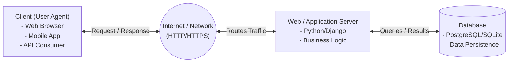
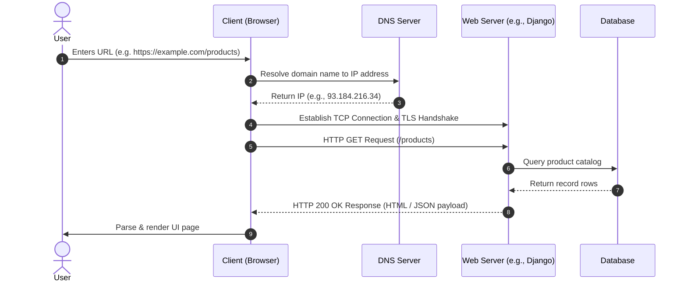
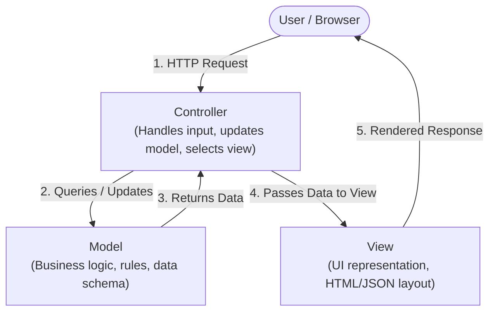
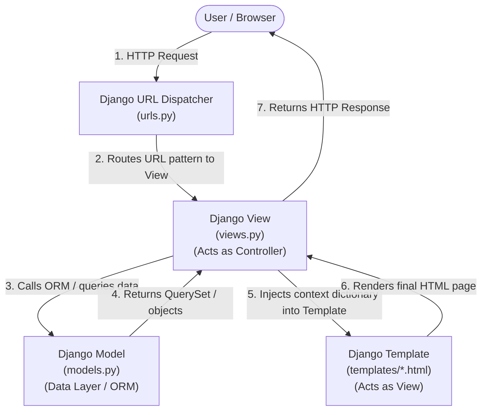
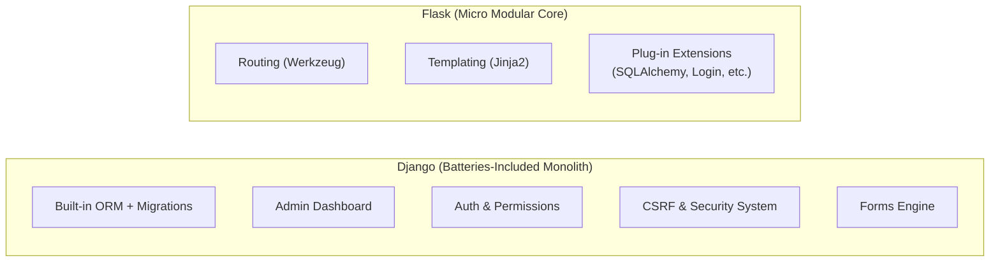
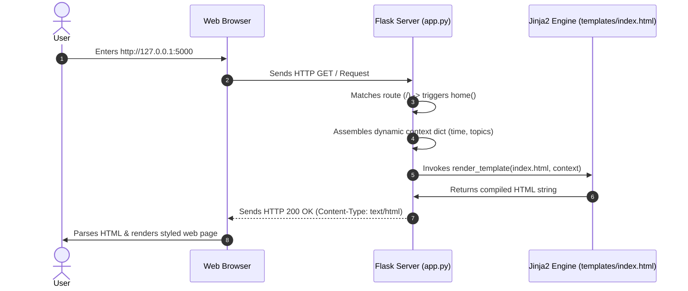
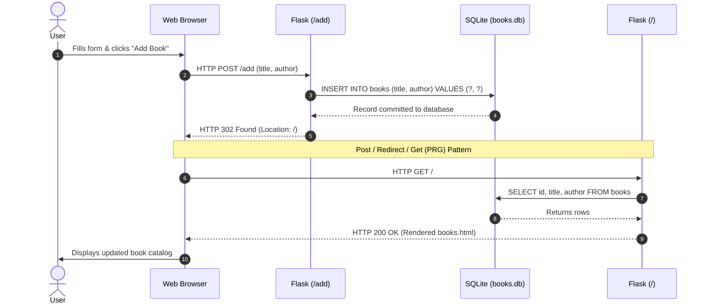

# Day 9: Web Architecture, Design Patterns & Flask Framework

Welcome to Day 9! Today we transition into web development concepts. We begin by understanding the architectural foundations of the World Wide Web: how distributed systems communicate, how protocols govern interactions, and how industry-standard design patterns structure web applications. Then, we dive into hands-on web development using the **Flask** micro-framework, learning how to isolate project dependencies with virtual environments and build our first web application serving dynamic HTML pages.

---

## Table of Contents
1. [Part 1: The Client-Server Architecture](#part-1-the-client-server-architecture)
2. [Part 2: The HTTP Request-Response Cycle](#part-2-the-http-request-response-cycle)
3. [Part 3: HTTP and HTTPS Protocols](#part-3-http-and-https-protocols)
4. [Part 4: Architectural Design Patterns: MVC & MVT](#part-4-architectural-design-patterns-mvc--mvt)
5. [Part 5: Introduction to Flask & Comparison with Django](#part-5-introduction-to-flask--comparison-with-django)
6. [Part 6: Python Virtual Environments (`venv`)](#part-6-python-virtual-environments-venv)
7. [Part 7: Flask Project Setup & First HTML Web Page](#part-7-flask-project-setup--first-html-web-page)
8. [Part 8: Practical Use Case: Book Management with Flask & SQLite](#part-8-practical-use-case-book-management-with-flask--sqlite)
9. [Summary & Quick Reference](#summary--quick-reference)

---

## Part 1: The Client-Server Architecture

Modern web systems are distributed systems built on the **Client-Server model**. In this model, tasks and workloads are partitioned between the provider of a resource or service (the **server**) and the service requester (the **client**).



### 1. The Client (Frontend / User Agent)
* **Definition**: Any software or hardware device that interacts with an end-user, captures input, and initiates communication by requesting resources.
* **Examples**: Web browsers (Chrome, Firefox, Safari), mobile applications (iOS/Android), command-line tools (`curl`, `httpie`), or automated scripts.
* **Core Responsibilities**:
  * Rendering user interfaces (HTML, CSS, JavaScript).
  * Capturing user actions (clicks, form submissions, keystrokes).
  * Validating inputs locally for immediate user feedback.
  * Formatting requests and sending them over the network.

### 2. The Server (Backend)
* **Definition**: A computer system or software daemon running continuously, listening on a specific network port, awaiting incoming client requests.
* **Tiers in a Web Server Stack**:
  * **Web Server (Reverse Proxy)**: Software like Nginx or Apache that receives incoming network requests, handles SSL termination, serves static assets (images, CSS), and forwards dynamic requests.
  * **WSGI / ASGI Gateway**: In Python, interfaces like Gunicorn or Uvicorn that bridge raw HTTP traffic from web servers into Python application code.
  * **Application Server**: The core business logic layer (e.g., Django, Flask, FastAPI).
  * **Database Server**: Persistent storage engines (PostgreSQL, MySQL, SQLite) managed via SQL or an ORM (Object-Relational Mapping).
* **Core Responsibilities**:
  * Enforcing security, user authentication, and authorization.
  * Executing business rules, calculations, and data processing.
  * Querying, mutating, and persisting state in databases.
  * Generating formatted responses (HTML web pages, JSON payloads, file downloads).

---

## Part 2: The HTTP Request-Response Cycle

The web operates on an exchange known as the **Request-Response Cycle**. Communication is strictly client-initiated: a client asks for something, and the server computes and answers.



### Anatomy of an HTTP Request
When a client sends a request, it constructs a structured text message composed of:

1. **Request Line**:
   * **Method / Verb**: The action to perform (e.g., `GET`, `POST`).
   * **Target / Path**: The requested resource endpoint (e.g., `/products/details?id=42`).
   * **Protocol Version**: e.g., `HTTP/1.1` or `HTTP/2`.
2. **Request Headers**: Key-value metadata describing the client and payload:
   * `Host: example.com` (Target server hostname).
   * `User-Agent: Mozilla/5.0 ...` (Information about the client device and browser).
   * `Accept: text/html, application/json` (Preferred formats the client can understand).
   * `Authorization: Bearer <token>` or `Cookie: sessionid=xyz` (Authentication credentials).
3. **Blank Line (`\r\n`)**: Standard boundary separating headers from the body.
4. **Request Body (Optional)**: Data sent to the server (e.g., form fields in a `POST` request or JSON data in an API call).

### Anatomy of an HTTP Response
The server evaluates the request, executes required logic, and returns a structured response:

1. **Status Line**:
   * **Protocol Version**: e.g., `HTTP/1.1`.
   * **Status Code**: 3-digit numeric indicator (e.g., `200`, `404`, `500`).
   * **Reason Phrase**: Human-readable status description (e.g., `OK`, `Not Found`).
2. **Response Headers**: Metadata describing the response and server configuration:
   * `Content-Type: text/html; charset=utf-8` (MIME type telling the browser how to parse the body).
   * `Content-Length: 1024` (Size of the payload in bytes).
   * `Set-Cookie: sessionid=abc123; HttpOnly; Secure` (Directs client to store session state).
3. **Blank Line (`\r\n`)**: Boundary separating headers from the body.
4. **Response Body**: The actual payload (HTML document, JSON array, image binary, etc.).

---

## Part 3: HTTP and HTTPS Protocols

### 1. HTTP (HyperText Transfer Protocol)
HTTP is an **application-layer protocol** defined by the IETF that serves as the foundation for data communication on the World Wide Web.

#### Key Characteristics of HTTP:
* **Stateless**: The server does not retain memory of previous interactions between consecutive requests. Every request is treated as completely independent.
  > [!NOTE]
  > **How is state maintained?** To simulate state (such as login sessions or e-commerce shopping carts), web applications use **Cookies**, **Sessions**, and **Tokens** (JWT) passed within request/response headers.
* **Connectionless / Independent**: After the request-response transaction completes, the direct connection can be closed (though modern `HTTP/1.1 Keep-Alive` and `HTTP/2` multiplexing keep TCP sockets open to transmit multiple requests efficiently).
* **Media Independent**: Any type of data (text, images, video, JSON, XML) can be transferred as long as both client and server specify the correct MIME type in the `Content-Type` header.
* **Default Port**: Port **`80`**.

---

### 2. Common HTTP Methods (Verbs)

HTTP defines standard methods indicating the desired action to be performed on a given resource:

| Method | Idempotent? | Safe? | Typical Purpose | Has Body? |
| :--- | :---: | :---: | :--- | :---: |
| **`GET`** | Yes | Yes | Retrieve representation of a resource. Query data is sent via URL parameters. | No |
| **`POST`** | No | No | Submit data to be processed (e.g., form submission, creating a new database record). | Yes |
| **`PUT`** | Yes | No | Completely replace an existing resource with the submitted payload. | Yes |
| **`PATCH`**| No | No | Apply partial modifications to an existing resource. | Yes |
| **`DELETE`**| Yes | No | Remove the specified resource. | Optional |
| **`HEAD`** | Yes | Yes | Identical to `GET`, but requests headers only (without the response body). | No |
| **`OPTIONS`**| Yes | Yes | Queries the communication options/methods supported by the target server (CORS preflight). | No |

> [!TIP]
> * **Safe**: Methods that do not modify server state (read-only operations like `GET` and `HEAD`).
> * **Idempotent**: Making multiple identical requests produces the exact same server state as making a single request (e.g., `GET`, `PUT`, `DELETE`).

---

### 3. HTTP Status Codes

Status codes are grouped into five distinct classes based on the first digit:

* **`1xx` Informational**: Request received, continuing process (e.g., `101 Switching Protocols`).
* **`2xx` Success**: Action successfully received, understood, and accepted:
  * `200 OK`: Standard response for successful requests.
  * `201 Created`: Request succeeded and a new resource was created (common with `POST`).
  * `204 No Content`: Request succeeded, but no payload is returned (common with `DELETE`).
* **`3xx` Redirection**: Further action required to complete the request:
  * `301 Moved Permanently`: Resource has permanently moved to a new URL.
  * `302 Found` (Temporary Redirect): Resource temporarily resides under a different URI.
  * `304 Not Modified`: Cached version on client is still fresh and valid.
* **`4xx` Client Error**: Request contains bad syntax or cannot be fulfilled:
  * `400 Bad Request`: Server cannot process request due to client syntax error.
  * `401 Unauthorized`: Authentication is required and has failed or is missing.
  * `403 Forbidden`: Server understood request, but refuses to authorize access.
  * `404 Not Found`: Requested resource cannot be located.
  * `405 Method Not Allowed`: HTTP verb used is not permitted for this endpoint.
* **`5xx` Server Error**: Server failed to fulfill an apparently valid request:
  * `500 Internal Server Error`: Generic unhandled runtime exception on the server.
  * `502 Bad Gateway`: Server received an invalid response from an upstream server.
  * `503 Service Unavailable`: Server is currently overloaded or down for maintenance.
  * `504 Gateway Timeout`: Upstream server failed to respond within designated timeout window.

---

### 4. HTTPS (HTTP Secure)

**HTTPS** is HTTP layered on top of the **TLS (Transport Layer Security)** or legacy **SSL (Secure Sockets Layer)** encryption protocol.

* **Default Port**: Port **`443`**.
* **Why Plain HTTP is Vulnerable**: Plain HTTP sends all data as unencrypted cleartext across public networks. Anyone eavesdropping (via Man-in-the-Middle attacks, packet sniffers, or compromised Wi-Fi networks) can inspect passwords, session cookies, and credit card numbers.

#### The Three Security Pillars of HTTPS:
1. **Confidentiality (Encryption)**: Data exchanged between client and server is encrypted using asymmetric and symmetric cryptography. Eavesdroppers cannot read intercepted packets.
2. **Integrity (Data Tamper-Proofing)**: Network packets include cryptographic message authentication codes (MACs). Data cannot be modified, injected, or corrupted in transit without detection.
3. **Authentication (Identity Verification)**: The server presents a digital certificate issued by a trusted **Certificate Authority (CA)**, proving to the browser that it is communicating with the authentic domain and not an imposter.

---

## Part 4: Architectural Design Patterns: MVC & MVT

When web applications grow beyond a single script, mixing database queries, business calculations, and HTML layout in one place results in **"spaghetti code"** that is fragile and difficult to test.

Software architecture uses the principle of **Separation of Concerns (SoC)** to decouple an application into distinct layers.

---

### 1. The MVC (Model - View - Controller) Pattern

MVC is the classic architectural pattern adopted by web frameworks such as Ruby on Rails, Spring MVC, Express (Node.js), and ASP.NET.



#### The Three MVC Components:
1. **Model (M)**:
   * Represents the **data structures**, schema, validation rules, and business logic.
   * Directly interfaces with the database (often via SQL or an ORM).
   * Does not know anything about how data will be displayed to the end user.
2. **View (V)**:
   * Responsible for **presentation and rendering**.
   * Takes processed data provided by the Controller and formats it into the final output (HTML markup, CSS, JSON, XML).
   * Should contain minimal to no business logic.
3. **Controller (C)**:
   * The **orchestrator / mediator**.
   * Intercepts incoming user HTTP requests from the router.
   * Coordinates with the Model to fetch or mutate data based on user input.
   * Selects the appropriate View, passes the data into it, and returns the response to the client.

---

### 2. The MVT (Model - View - Template) Pattern

**MVT** is a specialized variation of MVC popularized by the **Django** web framework. In Django, the separation of responsibilities is slightly shifted in terminology:



#### The Three MVT Components:
1. **Model (M)**:
   * Equivalent to the Model in MVC.
   * Defined in `models.py`.
   * Maps Python classes to database tables using the Django ORM.
   * Handles database schema, fields, relationships, and data validations.
2. **View (V)**:
   * **Important difference**: In Django, the View fulfills the role of the **Controller** in traditional MVC.
   * Defined in `views.py`.
   * Accepts an incoming `HttpRequest` object.
   * Executes business logic, interacts with Django Models to fetch/save data, and prepares a context dictionary.
   * Chooses which Template to render and returns an `HttpResponse` (or `JsonResponse`).
3. **Template (T)**:
   * Corresponds to the **View** in traditional MVC.
   * Stored in template files (e.g., `index.html`, `details.html`).
   * An HTML file enriched with **Django Template Language (DTL)** tags and filters (e.g., `{{ variable }}`, ``, ``).
   * Dynamically renders data passed from the View into the final HTML document presented to the user.

> [!NOTE]
> **Who is the Controller in Django?**
> In Django's MVT architecture, the role of the **Controller** is shared between:
> 1. The **Django Framework itself & URL Dispatcher (`urls.py`)**: Directs the incoming HTTP request to the designated view function.
> 2. The **View function/class (`views.py`)**: Intercepts input, controls data flow, and coordinates between Models and Templates.

---

### 3. Comparing MVC and MVT

| Feature / Aspect | Traditional MVC | Django's MVT |
| :--- | :--- | :--- |
| **Data & Persistence Layer** | **Model**: Classes, database schema, and queries. | **Model** (`models.py`): Python ORM classes and database interactions. |
| **Presentation / Layout Layer** | **View**: Generates UI layout and templates. | **Template** (`.html` files): HTML with Django Template Language (DTL). |
| **Application Logic / Controller**| **Controller**: Handles user requests, interacts with Model, updates View. | **View** (`views.py`): Receives `request`, queries `models`, and renders `template`. |
| **Routing / Dispatch Mechanism** | Router / Front Controller. | URL Dispatcher (`urls.py`) + Django Core Engine. |
| **Notable Frameworks** | Ruby on Rails, Express, Laravel, ASP.NET Core. | Django. |

---

## Part 5: Introduction to Flask & Comparison with Django

Python has two premier web frameworks that dominate industry adoption: **Flask** and **Django**. Both are battle-tested, production-ready, and capable of handling millions of requests, but they embody fundamentally contrasting design philosophies.

### 1. What is Flask?

**Flask** is a lightweight **WSGI (Web Server Gateway Interface) micro-framework** for Python. It was created by Armin Ronacher and is maintained by the Pallets Projects team.

#### Key Principles of Flask:
* **Micro-Framework**: "Micro" does not mean your entire application must fit into a single file, nor does it mean Flask lacks functionality. Rather, it means Flask's core is intentionally **minimal, unopinionated, and extensible**.
* **Under the Hood**: Flask is built directly upon two foundational libraries:
  1. **Werkzeug**: A comprehensive WSGI utility toolkit that handles HTTP request parsing, URL routing, response serialization, cookie handling, and an interactive local debugging server.
  2. **Jinja2**: A fast, sandboxed, and expressive Python templating engine that cleanly separates presentation markup (HTML) from backend Python code.
* **No Imposed Architecture**: Flask provides routing and template rendering, but it does **not** make decisions for you regarding:
  * Which database to use (relational SQL vs. NoSQL document stores).
  * Which ORM to use (SQLAlchemy, Peewee, Tortoise, or raw SQL queries).
  * How to structure folders (single script vs. blueprint-based modular packages).
  * How to validate forms or handle user authentication.
  You select and plug in only the libraries you actually need.

---

### 2. Comparing Flask and Django

Understanding when to reach for Flask versus Django is a fundamental skill in Python web development:



#### Detailed Comparison Matrix:

| Feature / Aspect | Flask | Django |
| :--- | :--- | :--- |
| **Framework Type** | Micro-framework (modular & minimalist) | Full-stack / "Batteries-included" framework |
| **Design Philosophy** | Unopinionated; developer chooses components freely | Opinionated; provides "The Django Way" for everything |
| **Project Structure** | Completely flexible (from 1 file to multi-package blueprints) | Rigid, standardized structure (`manage.py`, `settings.py`, `urls.py`, apps) |
| **Database & ORM** | None built-in (frequently paired with `SQLAlchemy` or raw `sqlite3`) | Robust built-in Django ORM with automatic schema migrations |
| **Admin Interface** | None included (can add community packages like `Flask-Admin`) | Production-ready, auto-generated administration portal out-of-the-box |
| **Authentication & Forms**| Handled via third-party extensions (`Flask-Login`, `Flask-WTF`) | Built-in authentication, session management, and `django.forms` |
| **Routing Pattern** | Function decorators directly on view functions: `@app.route("/")` | Centralized URL dispatcher (`urls.py`) mapped to view functions/classes |
| **Template Engine** | **Jinja2** | **Django Template Language (DTL)** (supports Jinja2 as well) |
| **Learning Curve** | Gentle, low barrier to entry; excellent for learning web fundamentals | Steeper initial learning curve due to large breadth of built-in tooling |
| **Ideal Use Cases** | Microservices, RESTful APIs, Single-Page App backends, small/medium utilities | Large content portals, e-commerce, enterprise backends, rapid MVPs |

---

## Part 6: Python Virtual Environments (`venv`)

Before writing a single line of web application code, professional Python development requires setting up an **isolated virtual environment**.

### 1. Why are Virtual Environments Essential?

When you run `pip install <package>` without a virtual environment, `pip` installs libraries into your **system-wide Python** directory. This creates severe problems:

1. **Dependency Conflicts ("Dependency Hell")**:
   * Suppose Project A relies on `Flask==2.0` (which uses older dependencies).
   * Suppose Project B relies on `Flask==3.1` (which introduces breaking changes).
   * In a global environment, installing Flask for Project B will overwrite and break Project A.
2. **Operating System Protection**:
   * Many modern operating systems (macOS, Ubuntu, Fedora) use system Python for critical OS maintenance scripts.
   * Installing or upgrading system-wide packages can alter standard libraries, destabilizing OS-level utilities.
3. **Reproducibility & Deployment (`requirements.txt`)**:
   * A virtual environment lets you lock and export the *exact* dependencies required for your project using `pip freeze > requirements.txt`.
   * Team members and production servers can then replicate the environment effortlessly using `pip install -r requirements.txt`.
4. **Clean Disposal**:
   * If a project is complete or an experiment goes wrong, deleting the virtual environment folder (`rm -rf .venv`) cleanly removes every installed package without leaving residue.

---

### 2. Managing Virtual Environments with `venv`

Python 3 includes the standard library module `venv` out of the box.

#### Step 1: Create the Virtual Environment
Navigate to your project folder and run:
```bash
# Syntax: python3 -m venv <environment_name>
python3 -m venv .venv
```
> [!TIP]
> Naming the folder `.venv` (with a leading dot) keeps it hidden in Unix file managers and is recognized automatically by editors like VS Code and PyCharm.

#### Step 2: Activate the Virtual Environment
Activation reconfigures your shell's `PATH` variable so that typing `python` and `pip` points to the isolated binaries inside `.venv/`:

* **macOS / Linux (zsh or bash)**:
  ```bash
  source .venv/bin/activate
  ```
* **Windows (Command Prompt / CMD)**:
  ```cmd
  .venv\Scripts\activate.bat
  ```
* **Windows (PowerShell)**:
  ```powershell
  .venv\Scripts\Activate.ps1
  ```
  *(If PowerShell gives an execution policy error, run `Set-ExecutionPolicy -Scope Process -ExecutionPolicy RemoteSigned` first).*

#### Step 3: Verify Activation
Once activated, your terminal prompt will display the environment name in parentheses:
```bash
(.venv) user@machine:~/my_project$ 
```
You can also verify that `python` and `pip` point to `.venv`:
```bash
# On macOS / Linux:
which python
# Output: /path/to/my_project/.venv/bin/python

# On Windows:
where python
# Output: C:\path\to\my_project\.venv\Scripts\python.exe
```

#### Step 4: Deactivate
When you are done working on the project, exit the virtual environment by running:
```bash
deactivate
```

---

## Part 7: Flask Project Setup & First HTML Web Page

Now that the environment fundamentals are clear, let's configure a complete Flask project from scratch and serve an HTML response when a user visits the homepage (`/`).

### 1. Recommended Project Directory Structure

Organizing files predictably from Day 1 ensures your application can scale cleanly:

```text
flask_intro/
├── .venv/                  # Virtual environment (never commit to git!)
├── templates/              # Jinja HTML template files
│   └── index.html          # Homepage HTML template (styled via Bootstrap CDN)
├── app.py                  # Main Flask application entrypoint & routes
├── requirements.txt        # Locked project dependencies
└── .gitignore              # Specifies files to exclude from version control
```

---

### 2. Step-by-Step Setup Walkthrough

#### Step A: Create Project Directory & Virtual Environment
Open your terminal and run:
```bash
# 1. Create and navigate to the project directory
mkdir flask_intro
cd flask_intro

# 2. Create the virtual environment
python3 -m venv .venv

# 3. Activate the virtual environment
source .venv/bin/activate    # On Windows: .venv\Scripts\activate
```

#### Step B: Install Flask
With the virtual environment activated, install the latest version of Flask:
```bash
pip install flask
```

#### Step C: Lock Dependencies in `requirements.txt`
```bash
pip freeze > requirements.txt
```
If you inspect `requirements.txt`, you will see Flask along with its core dependencies (`Werkzeug`, `Jinja2`, `click`, `itsdangerous`, `blinker`).

#### Step D: Create a `.gitignore` File
Ensure the virtual environment and cached bytecode are never tracked in version control:
```text
# .gitignore
.venv/
__pycache__/
*.pyc
.env
.DS_Store
```

---

### 3. Writing the Code

#### File 1: The Application Backend (`app.py`)

Create `app.py` in the root of `flask_intro/`:

```python
"""
app.py - Main Flask Application Entrypoint
"""

from datetime import datetime
from flask import Flask, render_template

# 1. Initialize the Flask application instance
# '__name__' tells Flask where to locate templates, static assets, and resources.
app = Flask(__name__)


# 2. Define the Homepage Route using the '@app.route' decorator
# This maps HTTP GET requests targeting the root URL ("/") to the 'home' view function.
@app.route("/")
def home():
    """
    View function for the homepage.
    Gathers context data and renders the HTML template.
    """
    # What does the variable 'context' represent?
    # In web development and template rendering engines (like Jinja2), "context" refers to a
    # dictionary (key-value mapping) that holds all the dynamic data, variables, or objects
    # created on the server that need to be passed to the frontend HTML template.
    # When Jinja2 parses the template, it looks up variable names (e.g., {{ title }}, {{ server_time }})
    # inside this context dictionary and replaces the placeholders with their actual values.
    context = {
        "title": "Welcome to Flask!",
        "heading": "Web Architecture in Action",
        "description": "This dynamic webpage is served using Python, Flask, and the Jinja2 template engine.",
        "server_time": datetime.now().strftime("%A, %B %d, %Y - %H:%M:%S"),
        "topics": [
            "Client-Server Communication",
            "HTTP Request / Response Cycle",
            "Separation of Concerns (MVC / MVT)",
            "Jinja2 Template Interpolation"
        ]
    }
    
    # render_template searches the 'templates/' directory for 'index.html'
    # and passes the context dictionary keyword arguments into it.
    return render_template("index.html", **context)


# 3. Application Execution Block
if __name__ == "__main__":
    # debug=True enables:
    # 1. Auto-reloader: Restarts the development server automatically upon code edits.
    # 2. Interactive Debugger: Displays rich traceback exceptions in the browser.
    # NOTE: Never run 'debug=True' in production!
    app.run(host="127.0.0.1", port=5000, debug=True)
```

---

#### File 2: The HTML Template (`templates/index.html`)

Create a folder named `templates` and inside it create `index.html`:

```html
<!DOCTYPE html>
<html lang="en">
<head>
    <meta charset="UTF-8">
    <meta name="viewport" content="width=device-width, initial-scale=1.0">
    <title>{{ title }}</title>
    <!-- Bootstrap 5 CSS via CDN -->
    <link href="https://cdn.jsdelivr.net/npm/bootstrap@5.3.3/dist/css/bootstrap.min.css" rel="stylesheet">
</head>
<body class="bg-light">
    <div class="container py-5">
        <div class="row justify-content-center">
            <div class="col-md-8">
                <div class="card shadow-sm">
                    <div class="card-body p-4">
                        <!-- Jinja2 Variable Interpolation -->
                        <h1 class="h3 text-primary mb-2">{{ heading }}</h1>
                        <p class="text-muted small mb-3">Server Rendered at: <strong>{{ server_time }}</strong></p>
                        
                        <p class="lead fs-6">{{ description }}</p>

                        <h5 class="mt-4 mb-3">Core Concepts Mastered Today:</h5>
                        <ul class="list-group mb-4">
                            <!-- Jinja2 Loop -->
                            
                                <li class="list-group-item">{{ topic }}</li>
                            
                        </ul>

                        <div class="text-center text-secondary small pt-3 border-top">
                            Flask 3.x &bull; CDAC Python Module &bull; Day 9
                        </div>
                    </div>
                </div>
            </div>
        </div>
    </div>
</body>
</html>
```

---

### 4. Running and Testing the Application

#### Step 1: Launch the Development Server
From within the `flask_intro/` directory (with `.venv` activated), execute:
```bash
python app.py
```
*(Alternatively, you can run `flask --app app run --debug`)*.

You will see the startup banner in your terminal:
```text
 * Serving Flask app 'app'
 * Debug mode: on
WARNING: This is a development server. Do not use it in a production deployment.
 * Running on http://127.0.0.1:5000
Press CTRL+C to quit
 * Restarting with stat
 * Debugger is active!
 * Debugger PIN: 123-456-789
```

#### Step 2: Open in Your Browser
Open your web browser and visit:
```text
http://127.0.0.1:5000
```
or
```text
http://localhost:5000
```

#### Step 3: Understanding the Execution Flow
What happens behind the scenes during this interaction?



Notice the corresponding terminal log emitted by Flask:
```text
127.0.0.1 - - [05/Sep/2026 10:00:01] "GET / HTTP/1.1" 200 -
```
This single log entry confirms:
* **Client IP**: `127.0.0.1` (localhost).
* **HTTP Request**: `GET / HTTP/1.1`.
* **HTTP Status Code**: `200` (OK / Success).

---

## Part 8: Practical Use Case: Book Management with Flask & SQLite

Now let's apply everything we have learned to build a functional data-driven web application: a **Book Management System**. 

The application allows users to:
1. **View all books** stored in a persistent SQLite database.
2. **Add a new book** (Title and Author) through an HTML web form.

We will maintain the data using Python's built-in `sqlite3` module without external ORM dependencies, keeping the implementation simple, fast, and focused on core Python and Flask mechanics. The interface uses Bootstrap 5 via CDN for clean styling without writing any custom CSS.

---

### 1. Application Flow & Architecture



---

### 2. Project Directory Structure

```text
flask_books/
├── .venv/                  # Virtual environment
├── templates/
│   └── books.html          # HTML template with Bootstrap 5 (Form + Table)
├── app.py                  # Database connection, queries, and route handlers
├── books.db                # SQLite database file (created automatically on startup)
├── requirements.txt        # Locked dependencies (flask)
└── .gitignore              # Ignores .venv/, books.db, __pycache__/
```

---

### 3. Application Code: `app.py`

Create `app.py`:

```python
"""
app.py - Book Management Web Application using Flask and SQLite3
"""

import sqlite3
from flask import Flask, render_template, request, redirect, url_for

# 1. Initialize the Flask application
app = Flask(__name__)
DATABASE = "books.db"


# 2. Database Connection Helper
def get_db_connection():
    """
    Creates and returns a connection to the SQLite database.
    Setting row_factory to sqlite3.Row allows accessing columns
    by name like a Python dictionary: row["title"].
    """
    conn = sqlite3.connect(DATABASE)
    conn.row_factory = sqlite3.Row
    return conn


# 3. Database Initialization
def init_db():
    """
    Initializes the database schema by creating the 'books' table
    if it does not already exist.
    """
    with get_db_connection() as conn:
        conn.execute("""
            CREATE TABLE IF NOT EXISTS books (
                id INTEGER PRIMARY KEY AUTOINCREMENT,
                title TEXT NOT NULL,
                author TEXT NOT NULL
            );
        """)
        conn.commit()


# 4. Route 1: View All Books (HTTP GET)
@app.route("/")
def index():
    """
    Fetches all books from SQLite and renders them in the template.
    """
    conn = get_db_connection()
    # Query all records ordered by latest added first
    books = conn.execute(
        "SELECT id, title, author FROM books ORDER BY id DESC"
    ).fetchall()
    conn.close()

    # Pass the 'books' records to the template via context
    return render_template("books.html", books=books)


# 5. Route 2: Add a Book (HTTP POST)
@app.route("/add", methods=["POST"])
def add_book():
    """
    Extracts form inputs from request.form and inserts a new book record.
    Redirects back to the index page upon completion (PRG Pattern).
    """
    # Extract submitted form data safely using .get()
    title = request.form.get("title", "").strip()
    author = request.form.get("author", "").strip()

    # Validate that neither field is empty
    if title and author:
        conn = get_db_connection()
        # Use parameterized query '?' to guard against SQL Injection
        conn.execute(
            "INSERT INTO books (title, author) VALUES (?, ?)",
            (title, author)
        )
        conn.commit()
        conn.close()

    # Redirect client browser to the homepage view function
    return redirect(url_for("index"))


# 6. Application Runner
if __name__ == "__main__":
    # Ensure the database table exists before handling web requests
    init_db()
    app.run(host="127.0.0.1", port=5000, debug=True)
```

---

### 4. Template: `templates/books.html`

Create `templates/books.html`:

```html
<!DOCTYPE html>
<html lang="en">
<head>
    <meta charset="UTF-8">
    <meta name="viewport" content="width=device-width, initial-scale=1.0">
    <title>Book Manager - Flask & SQLite</title>
    <!-- Bootstrap 5 CSS via CDN -->
    <link href="https://cdn.jsdelivr.net/npm/bootstrap@5.3.3/dist/css/bootstrap.min.css" rel="stylesheet">
</head>
<body class="bg-light">
    <div class="container py-5">
        <div class="row justify-content-center">
            <div class="col-md-8">
                
                <h1 class="h3 mb-4 text-center text-primary">Book Management System</h1>

                <!-- Section 1: Add Book Form -->
                <div class="card shadow-sm mb-4">
                    <div class="card-header bg-white">
                        <h5 class="card-title mb-0">Add a New Book</h5>
                    </div>
                    <div class="card-body">
                        <!-- Submits an HTTP POST request to /add -->
                        <form action="/add" method="POST">
                            <div class="mb-3">
                                <label for="title" class="form-label">Book Title</label>
                                <input type="text" class="form-control" id="title" name="title" placeholder="e.g., Fluent Python" required>
                            </div>
                            <div class="mb-3">
                                <label for="author" class="form-label">Author Name</label>
                                <input type="text" class="form-control" id="author" name="author" placeholder="e.g., Luciano Ramalho" required>
                            </div>
                            <button type="submit" class="btn btn-primary w-100">Add Book</button>
                        </form>
                    </div>
                </div>

                <!-- Section 2: View All Books Table -->
                <div class="card shadow-sm">
                    <div class="card-header bg-white d-flex justify-content-between align-items-center">
                        <h5 class="card-title mb-0">Book Catalog</h5>
                        <!-- Jinja2 Filter: |length counts items in the list -->
                        <span class="badge bg-secondary">{{ books|length }} books listed</span>
                    </div>
                    <div class="card-body p-0">
                        <!-- Jinja2 Conditional: check if books list has records -->
                        
                            <table class="table table-striped table-hover mb-0">
                                <thead class="table-light">
                                    <tr>
                                        <th scope="col" style="width: 15%;">ID</th>
                                        <th scope="col" style="width: 50%;">Title</th>
                                        <th scope="col" style="width: 35%;">Author</th>
                                    </tr>
                                </thead>
                                <tbody>
                                    <!-- Jinja2 Loop: iterate through every row -->
                                    
                                        <tr>
                                            <td>#{{ book["id"] }}</td>
                                            <td><strong>{{ book["title"] }}</strong></td>
                                            <td>{{ book["author"] }}</td>
                                        </tr>
                                    
                                </tbody>
                            </table>
                        
                            <div class="p-4 text-center text-muted">
                                No books found in the database. Add your first book above!
                            </div>
                        
                    </div>
                </div>

                <div class="text-center text-secondary small mt-4">
                    Flask + SQLite3 &bull; CDAC Python Module &bull; Day 9
                </div>

            </div>
        </div>
    </div>
</body>
</html>
```

---

### 5. Detailed Explanations of Key APIs & Methods Used

Understanding the exact mechanics behind each method distinguishes a professional Python developer from someone copying snippets:

#### A. Database Methods (`sqlite3`)

1. **`sqlite3.connect(DATABASE)`**:
   * Opens a file connection to the SQLite database file (`books.db`).
   * If the file does not exist on disk, SQLite automatically creates it.
2. **`conn.row_factory = sqlite3.Row`**:
   * **Why this is critical**: By default, `sqlite3` cursor queries return standard Python tuples: `(1, 'Fluent Python', 'Luciano Ramalho')`. In templates, you would be forced to write `{{ book[1] }}` which is unreadable and error-prone.
   * `sqlite3.Row` wraps each row so it behaves both as a tuple and as a **case-insensitive dictionary**. In Python and Jinja, you can access columns by their exact column name: `book["title"]` and `book["author"]`.
3. **Parameterized Queries (`?` Placeholders)**:
   * Notice line: `conn.execute("INSERT INTO books (title, author) VALUES (?, ?)", (title, author))`
   * **Security Rule**: Never construct SQL queries using f-strings or string concatenation:
     ```python
     # NEVER DO THIS: Critical SQL Injection Vulnerability!
     conn.execute(f"INSERT INTO books VALUES ('{title}', '{author}')")
     ```
   * Passing parameters as a tuple via `(title, author)` lets the SQLite driver escape and sanitize the values, preventing SQL injection attacks.
4. **`conn.commit()` & `conn.close()`**:
   * `conn.commit()`: Flushes uncommitted in-memory SQL mutations to disk.
   * `conn.close()`: Closes the OS file descriptor handle to prevent file locking and memory leaks.

---

#### B. Flask Routing & HTTP Verb Methods

1. **`@app.route("/", methods=["GET"])`**:
   * When `methods` is omitted, Flask defaults to `["GET"]`.
   * Used for safe, idempotent read-only queries.
2. **`@app.route("/add", methods=["POST"])`**:
   * Restricts `/add` exclusively to HTTP `POST` requests.
   * If someone tries to access `http://127.0.0.1:5000/add` directly in their browser URL bar (which sends a `GET` request), Flask automatically blocks it and responds with `HTTP 405 Method Not Allowed`.

---

#### C. Request Processing (`request.form`)

1. **The `request` Context-Local Object**:
   * Flask makes the incoming HTTP request accessible via `from flask import request`.
   * It inspects headers, query strings, and body payloads for the currently running thread/context.
2. **`request.form`**:
   * A dictionary-like `ImmutableMultiDict` containing all parsed key-value pairs submitted by an HTML form with `enctype="application/x-www-form-urlencoded"`.
   * The keys match the `name="..."` attributes in HTML: `<input name="title">` $\rightarrow$ `request.form["title"]`.
3. **`request.form.get("title", "")`**:
   * Using `.get("key")` is safer than `request.form["key"]`. If a key is missing, `request.form["key"]` raises a `KeyError` resulting in a `400 Bad Request` crash. `.get()` returns `None` (or a fallback default), allowing graceful validation.

---

#### D. Response Redirection & The PRG Pattern

1. **`redirect(location)`**:
   * Returns an HTTP `302 Found` response with a `Location: /` header, directing the client browser to immediately initiate a fresh `GET /` request.
2. **`url_for("index")` (Reverse URL Resolution)**:
   * Instead of hardcoding URL paths like `redirect("/")`, we pass the name of the Python view function: `url_for("index")`.
   * **Advantage**: If you later change the URL route in `@app.route("/home")`, `url_for("index")` continues working without breaking your redirection code.
3. **The Post/Redirect/Get (PRG) Pattern**:
   * **Problem**: What happens if `/add` directly returns `render_template(...)` upon adding a book? If the user refreshes the page, the browser will re-send the original `POST` request, inserting the book a second time and displaying the dreaded *"Confirm Form Resubmission"* popup.
   * **Solution**: By issuing a `redirect()` after every successful `POST`, the browser transitions into a standard `GET /` request. Refreshing the browser now simply reloads the book list safely without duplicating data.

---

#### E. Jinja2 Template Directives Used

1. **`{{ books|length }}`**:
   * Uses Jinja's built-in `|length` filter to count the items in the `books` list dynamically.
2. **` ...  ... `**:
   * Conditional rendering block. Shows the catalog table if books exist, or displays an empty state banner if no records are found.
3. **` ... `**:
   * Iterates through the list of `sqlite3.Row` objects passed from Flask and generates a table row (`<tr>`) for each record.

---

## Summary & Quick Reference

* **Client-Server Architecture**: Segregates user presentation (browsers/clients) from business logic, computation, and data persistence (servers/databases).
* **Request-Response Cycle**: The client sends a request (Method + Path + Headers + Body), the server processes it, and returns a response (Status Code + Headers + Body).
* **HTTP vs. HTTPS**: HTTP is an unencrypted, stateless application-layer protocol running on port 80. HTTPS adds TLS/SSL encryption and certificate validation on port 443 to guarantee confidentiality, integrity, and authentication.
* **HTTP Verbs**: `GET` (fetch), `POST` (create), `PUT` (full replace), `PATCH` (partial update), `DELETE` (remove).
* **Status Code Ranges**: `2xx` (Success), `3xx` (Redirection), `4xx` (Client Error), `5xx` (Server Error).
* **MVC vs. MVT**:
  * **MVC**: Model (Data) $\leftrightarrow$ Controller (Logic) $\leftrightarrow$ View (Presentation).
  * **MVT**: Model (Data) $\leftrightarrow$ View (Logic) $\leftrightarrow$ Template (Presentation).
* **Flask vs. Django**:
  * **Flask**: Minimalist, unopinionated micro-framework built on Werkzeug + Jinja2. Gives developers full architectural freedom.
  * **Django**: Feature-rich, "batteries-included" monolith with built-in ORM, admin panel, authentication, and security protections.
* **Virtual Environments (`venv`)**:
  * Isolate package dependencies per project to avoid version collisions and protect system Python.
  * Create: `python3 -m venv .venv`
  * Activate: `source .venv/bin/activate` (macOS/Linux) or `.venv\Scripts\activate` (Windows).
  * Lock: `pip freeze > requirements.txt`
* **Flask Context**:
  * The dictionary of data passed from the view function into `render_template(template, **context)`. Jinja2 references keys as variables (e.g. `{{ title }}`).
* **Data-Driven Flask with SQLite**:
  * `sqlite3.connect()` with `conn.row_factory = sqlite3.Row` enables dictionary-like column access in templates (`book["title"]`).
  * Always use parameterized SQL (`?`) to prevent SQL injection.
  * Form inputs are received via `request.form.get("fieldname")`.
  * Always apply the **Post/Redirect/Get (PRG)** pattern using `redirect(url_for("view_name"))` after handling `POST` requests to prevent duplicate submissions on page refresh.
